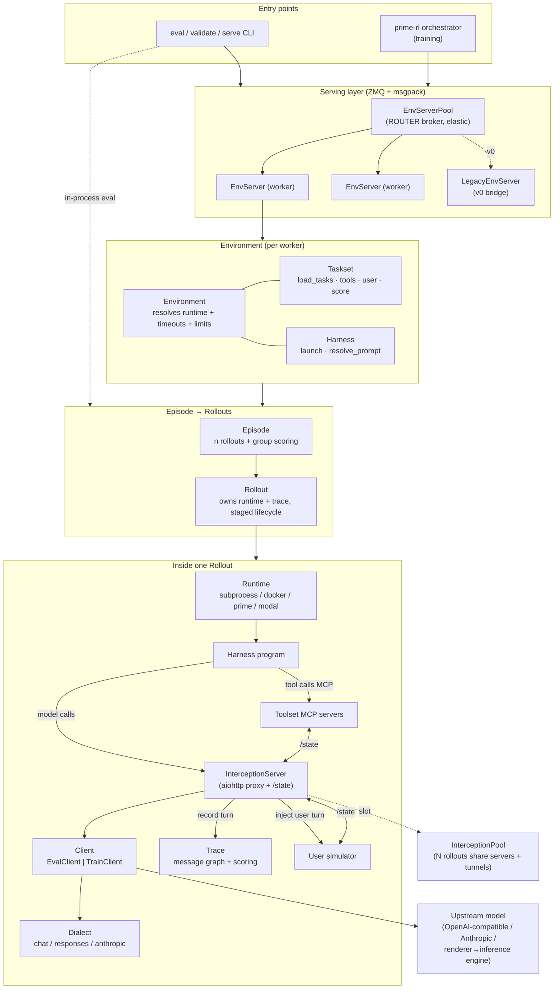
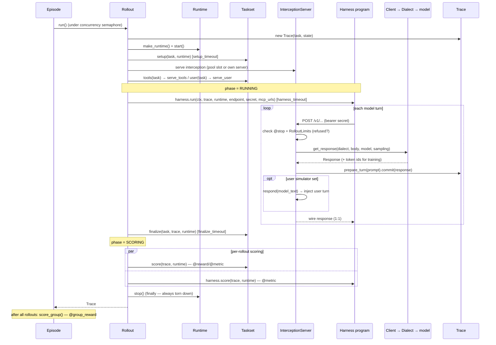
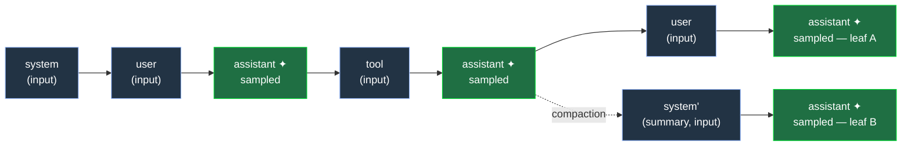
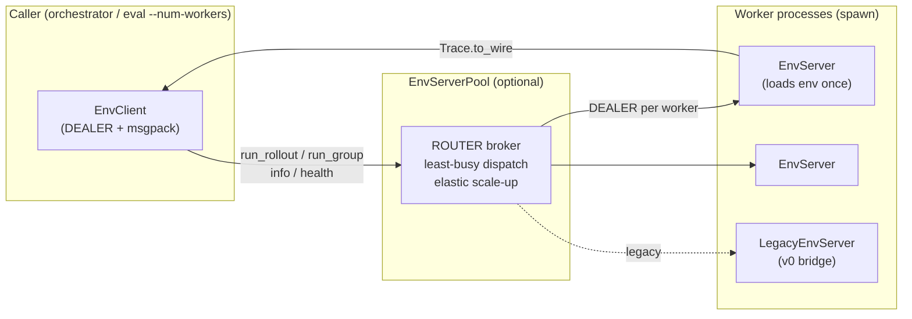

# verifiers v1 — Architecture

> A clean-slate, heavily-typed reimplementation of the verifiers core. This document
> describes the `verifiers.v1` package: its components, the data they hold, and how they
> compose to run and score one rollout. For the v0↔v1 design comparison see
> [`COMPARE.md`](COMPARE.md); for user-facing docs see [`docs/`](docs/).

## The model in one sentence

An **environment** is a **taskset** (data + scoring) composed with a **harness** (the program
that drives the conversation) running in a **runtime** (where that program executes), with
every model call flowing through an **interception server** that records it into a typed
**trace**.

```
Environment  =  Taskset  ×  Harness  ×  Runtime
                (data +      (drives    (where the
                 scoring)     control    program
                              flow)      runs)
```

Three orthogonal axes, chosen independently at eval time:

- **Taskset** — *what* to solve and how to judge it. Yields typed `Task`s, exposes optional
  tools (`Toolset`) and an optional user simulator (`User`), and owns scoring
  (`@reward`/`@metric`/`@group_reward`).
- **Harness** — *how* the conversation is driven. A program (a small Python script, the `rlm`
  binary, Codex, …) that runs in the runtime and makes model calls. The taskset never sees the
  control flow; the harness never sees the scoring.
- **Runtime** — *where* the harness program runs (a local subprocess, a Docker container, a
  Prime/Modal sandbox), giving an isolated, optionally containerized execution environment.

Anything that is *framework policy* — turn caps, token budgets, timeouts, retries, the
trajectory record — lives in the framework (the interception server and the rollout
lifecycle), never in the taskset or harness, so it applies uniformly to any combination.

---

## Component map



**Reading the map.** A run enters either through the **CLI** (`eval`, `validate`, `serve`) or
the **prime-rl orchestrator** (training). Both drive an **`Environment`** — directly
in-process (eval), or over a **ZMQ env server** (training, and `eval --num-workers > 0`),
optionally fronted by an elastic **`EnvServerPool`**. The environment turns one task into an
**`Episode`** of *n* **`Rollout`s**. Each rollout starts a **`Runtime`**, runs the **harness
program** in it, and points the program's model calls at an **`InterceptionServer`**, which
forwards them through a **`Client`**/**`Dialect`** to the real model and records every turn
into the **`Trace`**. Tool servers and a user simulator attach to the same rollout and share
per-rollout state with the interception server over its **`/state`** channel.

---

## Lifecycle of a rollout



The lifecycle is **staged**, each stage under its own wall-clock timeout
([`TimeoutConfig`](#timeouts-limits-and-retries)), and the runtime is torn down in a
`finally` so it can never leak — even if `run()` crashes mid-stage. A `RolloutError` is
*captured onto the trace* rather than raised: a bad rollout is **data, not a crash**.
Cross-rollout `@group_reward`s run afterwards in the `Episode`, over the traces alone (no live
runtime needed).

| Phase | What happens | Timeout |
|-------|--------------|---------|
| `SETUP` | `make_runtime` + `runtime.start()`, then `Taskset.setup` (per-task runtime prep), then serve interception + tool/user servers | `setup_timeout` (wraps `Taskset.setup`) |
| `RUNNING` | The harness program drives the conversation; model calls hit the interception server | `harness_timeout` (a timeout here is a budget limit → clean truncated trace, not an error) |
| `FINALIZE` | `Taskset.finalize` — post-run work while the runtime is still live (apply a diff, run a build, scrape artifacts into `trace.info`) | `finalize_timeout` |
| `SCORING` | `Taskset.score` ∥ `Harness.score` (per-rollout `@reward`/`@metric`), concurrently, runtime still live | `scoring_timeout` |
| `DONE` | Set by the `Episode` after `@group_reward`s (or immediately, with no group rewards) | — |

---

## Core abstractions

Everything is **pydantic-typed** and uses **generics** so that a taskset's `Task`, `Config`,
and `State` types flow — fully typed — from `load_tasks` through the rollout and into scoring.
Plugins (tasksets, harnesses) are resolved by **id** at eval time, not by a closed union, so a
new environment is just a package that exports its subclass.

### Environment

The eval-level **composition and resolver**. It holds the taskset, harness, and the
config-level knobs, lists the tasks, and turns one task into a runnable `Episode`. It does
**not** itself run rollouts — execution lives one level down in `Episode`/`Rollout`.

| Attribute | Type | Role |
|-----------|------|------|
| `config` | `EnvConfig` | the full env definition (taskset + harness + limits + timeouts + retries + multiplex) |
| `taskset` | `Taskset` | resolved via `load_taskset(config.taskset)` |
| `harness` | `Harness` | resolved via `load_harness(config.harness)` |
| `limits` | `RolloutLimits` | `max_turns` + token budgets, enforced by the interception server |
| `setup/harness/finalize/scoring_timeout` | `float \| None` | per-stage wall-clock caps |
| `_shared_urls` | `dict[str,str]` | shared tool-server URLs, live only inside `serving()` |
| `_interception` | `InterceptionPool \| None` | the eval-level interception pool, live only inside `serving()` |

Key methods: `runtime_for(task)` (resolve the task's runtime config off the harness's, with
`cli/toml > task > default` precedence), `episode(task, ctx, n)` (build *n* rollouts sharing
the resolved runtime/timeouts/limits + shared serving resources, wrapped in an `Episode`),
`serving(tasks)` (async context holding the shared tool servers and interception pool for a
whole eval), `interception_pool()` and `shared_tools(tasks)`.

At construction the `Environment` enforces **composition compatibility** — it refuses a
taskset with tools on a harness that lacks `SUPPORTS_TASK_TOOLS`, a user simulator on a
harness lacking `SUPPORTS_USER_SIM`, and a `NEEDS_CONTAINER` taskset on the subprocess
runtime; it warns when a non-default harness runs on the local subprocess runtime.

`EnvConfig` is the picklable, serializable env definition (`SerializeAsAny` on `taskset` /
`harness` so resolved subclass fields survive `model_dump`). `EnvServerConfig` extends it with
`pool: PoolConfig` (`static` | `elastic`) for the worker pool. A `model_validator` narrows the
generic `taskset`/`harness` configs to their concrete types by `id`, so plugin-specific
`--taskset.* / --harness.*` fields validate.

### Taskset

The **data + judgement** half of an environment — `Taskset[TaskT, ConfigT, StateT]`. It yields
typed tasks, optionally exposes tools and a user simulator, and is the single scoring
authority. All task framing lives in each task's prompt; the harness drives control flow.

| Member | Kind | Role |
|--------|------|------|
| `NEEDS_CONTAINER` | `ClassVar[bool]` | force a container runtime (refuse subprocess) |
| `config` | `ConfigT` | the resolved taskset config |
| `load_tasks()` | method | produce the list of typed `Task`s (the index range) |
| `tools(task)` | method | the task's `Toolset` MCP servers (empty by default) |
| `user(task)` | method | the task's `User` simulator (`None` by default) |
| `setup(task, runtime)` | hook | per-task runtime prep, after `start()`, before the harness |
| `finalize(task, trace, runtime)` | hook | post-run work while the runtime is live, before scoring |
| `validate(task, runtime)` | hook | model-free gold check (the `validate` entrypoint only) |
| `score(trace, runtime)` | method | run `@metric` then `@reward` over one trace |
| `score_group(traces)` | method | run `@group_reward` across a task's rollouts |

Scoring is declared with **decorators** that are discovered by `discover_decorated` and
dependency-injected by parameter name (`invoke`): `@reward`/`@metric` receive any of
`task`/`trace`/`runtime`; `@group_reward` receives `task`/`traces`; `@stop` is a
`(self, trace) -> bool` checked by the interception server before each turn. `@reward`/`@group_reward`
carry a `weight`; results land in `trace.rewards` (summed into `trace.reward`) and `trace.metrics`.

### Harness

The program that **drives the conversation**, `Harness[ConfigT]`. It provisions itself into
the already-started runtime and runs there; its model calls hit the interception server, which
records the turns. Concrete harnesses differ only in *how* they provision + invoke.

| Member | Kind | Role |
|--------|------|------|
| `APPENDS_SYSTEM_PROMPT` | `ClassVar[bool]` | emit `task.system_prompt` as a real system message (else fold into the user message) |
| `SUPPORTS_TASK_TOOLS` | `ClassVar[bool]` | expose the task's MCP tools to the model (default `True`) |
| `SUPPORTS_USER_SIM` | `ClassVar[bool]` | drive a user simulator (opt-in per harness) |
| `SUPPORTS_MESSAGE_INSTRUCTION` | `ClassVar[bool]` | accept a `Messages`-list instruction (e.g. images) |
| `config` | `ConfigT` | resolved `HarnessConfig` (`id`, `runtime`, `env`, `disabled_tools`) |
| `resolve_prompt(task)` | method | `(system_prompt, user_instruction)` for this harness |
| `launch(ctx, trace, runtime, endpoint, secret, mcp_urls)` | **abstract** | run the harness program in the runtime, return a `ProgramResult` |
| `run(...)` | method | call `launch`, set the stop condition from the exit code |
| `score(trace, runtime)` | method | run the harness's own `@metric`s over the finished trace |

Crucially, `HarnessConfig.runtime` lives on the **harness** — it is the harness's box. The
harness program reads `ctx.model` and the `endpoint`/`secret` it's handed and points its model
calls there; tool servers it reaches via `mcp_urls`. Built-in harnesses (`packages/harnesses/`)
include `default` (a small staged Python script run via `run_uv_script`), `rlm`, `codex`,
`claude_code`, `kimi_code`, and `mini_swe_agent`; built-in tasksets (`packages/tasksets/`)
include `harbor_v1` and `textarena_v1`.

### Runtime

The **isolated execution environment** where the harness program runs — a `Runtime` ABC over
four backends, selected by `RuntimeConfig` (a discriminated union on `type`). It abstracts both
*where* a program runs and *how* a service reaches it (localhost vs. tunnel).

| Runtime | `is_local` | Backend | Notable config |
|---------|:---------:|---------|----------------|
| `SubprocessRuntime` | ✓ | local process in `/tmp/{name}` | (none) — inherits host env minus `*API_KEY*` |
| `DockerRuntime` | ✓ | local container, `--network host` | `image`, `workdir`, `cpu`, `memory`, `gpu`, `disk` |
| `ModalRuntime` | ✗ | Modal sandbox | + `region`, `timeout`, `network_access`, `creates_per_sec` |
| `PrimeRuntime` | ✗ | Prime sandbox | + `vm`, `guaranteed`, `labels`, `creates_per_min` |

The ABC's surface: `start()` / `stop()` (provision / free), `run(argv, env) -> ProgramResult`,
`run_background(argv, env, log)`, `read(path)` / `write(path, data)`, `expose(port)` (publish a
port *inside* the runtime to a host-reachable URL — `None` for local), and `run_uv_script(...)`
(run a PEP 723 script with inline deps; built on `write`+`run`, so it works everywhere — the
`default` harness uses it). `ProgramResult` is a frozen `(exit_code, stdout, stderr)`.

**Reachability** is the runtime layer's other job, all routed through one helper:

```
reachable_url(service, port, consumer)
  ├─ service is consumer            → http://127.0.0.1:{port}   (colocated)
  ├─ service in a remote sandbox    → service.expose(port)      (public URL)
  └─ service on the host network    → host_endpoint(port)       (localhost, or a tunnel
                                                                  if the consumer is remote)
```

`HOST` is a sentinel for the host network (the interception server, shared tools). Remote
runtimes (`is_local=False`) need a `prime_tunnel` tunnel for a program inside them to reach a
host service; `runtime_is_local(config)` answers this without provisioning. Two limiters guard
provider quotas: a per-account **`CreationLimiter`** (sandbox creation rate, shared across all
host processes via a lockfile bucket) and the global **`TUNNEL_LIMITER`** (512/min — the cap
the `multiplex` design exists to beat). `RetryingRuntime` wraps a runtime to retry transient
infra faults (provisioning, exec, I/O) but never program failures. `make_runtime(config, name)`
is the factory; every runtime is registered for an atexit cleanup backstop.

### Client and dialects

A **`Client`** is the boundary to the actual model. The same interception request takes one of
two opposite paths depending on the resolved client:

- **`EvalClient`** — a thin `httpx` forwarder. `get_response` relays the program's native
  request **1:1** to an upstream OpenAI-compatible / Anthropic endpoint (only overlaying the
  eval's model + sampling), parses a copy into a typed `Response` for the trace, and keeps the
  provider's verbatim bytes on `Response.raw` so the interception server returns them
  unchanged. Implements `relay` (SSE streaming) and `relay_aux` (side requests like
  `count_tokens`).
- **`TrainClient`** — client-side tokenization for RL. It parses the body into typed
  `Messages`, renders them with a chat-template **renderer pool**, calls vLLM's
  `/inference/v1/generate`, and returns a `Response` carrying **token ids + logprobs**
  (`Response.tokens`) — the trainable signal. `Response.raw` is a synthesized completion (it
  generates, so there's nothing to relay). Chat dialect only.

Both share `RolloutContext` (`client`, `model`, `sampling`) — the frozen bundle a harness needs
— and a `SESSION_ID_HEADER` (`X-Session-ID`, the trace id) so a session-affinity router pins a
rollout's turns to one engine for KV-cache reuse. `RetryingClient` wraps a client to retry
`ModelError` (but never `OverlongPromptError`, which is a budget limit). `resolve_client`
dispatches `TrainClientConfig -> TrainClient`, else `EvalClient`; client configs describe the
endpoint (`base_url`, `api_key_var`, `headers`, with Prime CLI fallback).

A **`Dialect`** is the wire-format adapter — *which* provider API shape a request speaks. Three
are registered and served simultaneously; the interception server routes by **path**:

| Dialect | Route | Upstream | Notes |
|---------|-------|----------|-------|
| `ChatDialect` | `/v1/chat/completions` | `/chat/completions` | OpenAI chat; the only dialect `TrainClient` supports; supports `extend` (user-sim) |
| `ResponsesDialect` | `/v1/responses` | `/responses` | OpenAI Responses API; folds assistant runs; permissive (`extra="allow"`) |
| `AnthropicDialect` | `/v1/messages` (+ `…/count_tokens` aux) | `/v1/messages` | `x-api-key` auth; thinking → `reasoning_content` |

Each dialect implements `parse_request` (wire → `Messages` + `Tools`), `parse_response` /
`validate_response` (wire → typed `Response`), `parse_stream` (assemble SSE deltas),
`apply_overrides` (inject the eval's model + sampling in native shape), plus `auth_headers` /
`secret` / `error_body` for provider-specific auth and error envelopes. Adding a provider is
implementing one `Dialect` — no `Client` change.

### Interception server and pool

The **`InterceptionServer`** is the linchpin: an `aiohttp` proxy on a host port that every
harness's model calls flow through. It is where framework policy is applied uniformly,
regardless of harness or provider.

| Attribute | Type | Role |
|-----------|------|------|
| `sessions` | `dict[str, RolloutSession]` | rollouts multiplexed on one server, keyed by bearer secret |
| `port` | `int` | the ephemeral host port |
| `runner` | `web.AppRunner` | the aiohttp app (routes for every dialect + `/state`) |

Per request it: authenticates the rollout by its bearer `secret`; checks `@stop` conditions and
`RolloutLimits` (`refused()` → end cleanly mid-conversation, or 400 before the first turn);
calls `graph.prepare_turn(trace, prompt)`; forwards through `session.ctx.client.get_response`;
**records the turn** with `turn.commit(response)`; and returns the wire response 1:1. It also
hosts the **`/state`** channel (`GET`/`PUT`, same bearer auth) through which tool and user
servers read and write the rollout's shared `Trace.state`. A `RolloutSession` bundles
`ctx`, `trace`, `stops`, `limits`, and the optional `user` simulator (whose `respond` it calls
after each model turn, injecting the reply as a user turn — the harness never sees it).

The **`InterceptionPool`** multiplexes *N* concurrent rollouts onto fewer servers (and, behind
a remote runtime, fewer tunnels). `acquire(session)` hands a rollout `(endpoint, secret,
state_port)`: it reuses a `PooledServer` with spare capacity (`load < multiplex`) or brings up
a new one, wrapping its host port in `reachable_url(HOST, port, consumer=runtime)` so an
in-sandbox harness can reach it. This is the mechanism behind `multiplex=32`: *N* rollouts use
~`N/multiplex` servers + tunnels instead of one each — the key to staying under the 512/min
tunnel cap.

### Episode and Rollout

A **`Rollout`** owns one trajectory end-to-end, including its runtime's lifecycle (see
[Lifecycle](#lifecycle-of-a-rollout)). It makes + starts the runtime, gets an interception
endpoint (a pool slot, or its own server), drives the staged lifecycle under per-stage
timeouts, and tears the runtime down in a `finally`. It exposes `runtime`, `trace`, and `phase`
live for the `--rich` dashboard. An **`Episode`** is the largest unit the *evaluator* knows: it
runs *n* rollouts of one task under a shared concurrency `semaphore`, then runs the
cross-rollout `@group_reward` stage over their traces. Per-rollout rewards are final the moment
a rollout's own scoring ends (marked `DONE`, persisted via `on_complete`); with group rewards,
the whole group is finalized together. Training-time transforms of rewards (advantages, GRPO,
RLOO) are deliberately **not** modeled here — they sit a level up, in the trainer that consumes
episodes.

### MCP: Toolset and User

Both a task's tools and its user simulator are **MCP servers** authored as vf-native classes
(`Toolset` / `User`), sharing a common `ServerBase`. They are launched as real server processes
(`python -m <env module>`) — colocated in the harness's runtime, in their own runtime, or
reused from a pre-existing remote URL — and reached over streamable-HTTP MCP. The split: a
`Toolset` is **called by the model** (the harness wires its URL in as MCP tools); a `User` is
**driven by the framework** (the interception server calls its `respond` after each model turn
and injects the reply as a user turn — the harness is unaware).

| | `Toolset[ConfigT, StateT]` | `User[ConfigT, StateT]` |
|---|---|---|
| Authored as | class with `@vf.tool` methods | class with one `respond(message) -> Messages` |
| Exposed to | the **model** (as `<PREFIX>_<tool>`) | the **framework** (not the model) |
| Placement (`*Config`) | `colocated` / own `runtime` / remote `url` | `colocated` / own `runtime` |
| Scope | per-rollout, or `shared` (once per eval) | per-rollout |
| Declared by | `Taskset.tools(task) -> list[Toolset]` | `Taskset.user(task) -> User \| None` |

`ServerBase` gives both their **shared-state sync**: `config`, a typed `state: StateT`, and a
`_with_state` wrapper that, around every tool/`respond` call, does an HTTP **`GET /state`** to
pull the rollout's `Trace.state`, runs the method, then **`PUT /state`** if it changed
(last-write-wins). The channel is the interception server, located via `VF_STATE_URL` /
`VF_STATE_SECRET` env vars (the same bearer secret as the model routes). This is how a tool,
the user sim, and scoring all see the same per-rollout `State` even though they run in separate
processes. Lifecycle hooks: `setup()` (task-agnostic, runs for every server) and `setup_task(task)`
(per-rollout, **skipped for `shared` servers** so a shared corpus can't leak one task's data).

The host-side launchers (`launch.py`) resolve placement and reachability:

- **`serve_shared(toolsets, agent_is_local)`** — start `shared` servers **once** for the eval
  (each in its own runtime, bridged to the host once if the harness is remote), yielding
  `{name: url}`; reuse a remote `url` as-is. Held open by `Environment.serving`.
- **`serve_tools(toolsets, runtime, task, shared_urls, state_port, state_secret)`** — per
  rollout: skip remote `url`s, reuse anything in `shared_urls`, else launch via `serve()`,
  yielding `{name: url}` the harness wires in as tools.
- **`serve_user(user, task, agent_runtime, state_port, state_secret)`** — per rollout: launch
  the simulator `for_host=True` (so the framework, not the model, reaches it) and yield the
  `respond` callable that the interception server stores on the session.

When a server runs in a sandbox, `serve()` first uploads the working-tree verifiers source +
the env package and installs them, then probes `…/mcp` until healthy — so there is **no git
pin** for the in-sandbox code; it mirrors the host's working tree.

---

## Data model

Three frozen/typed pydantic objects carry a rollout: the immutable **`Task`** in, the
**`Trace`** out, and the **wire types** that cross the model boundary. The trajectory itself is
a **`MessageNode` graph** inside the trace.

### Task → Trace

**`Task`** (`StrictBaseModel`, `frozen=True`) is the immutable rollout input. Environments
subclass it to add typed fields (the reference answer, ground truths, …) that flow — typed —
into scoring. Base fields: `idx` (stable index), `instruction` (`str | Messages | None` — the
prompt; `None` means the user simulator opens), `system_prompt`, `image` (forces a container),
`workdir`, the four per-task stage timeouts, and `resources` (`cpu`/`memory`/`gpu`/`disk`).
**`WireTask`** is a `Task` with `extra="allow"` so a `Trace[WireTask]` can ride the wire
without the consumer importing the taskset (extra fields land in `model_extra`; a caller that
imports the taskset upgrades via `task_type(id)`).

**`Trace[TaskT, StateT]`** is the full record of one rollout — written to `results.jsonl`,
consumed by the platform (visualization) and by prime-rl (training). The rollout mutates it
directly.

| Field | Type | Persisted? | Role |
|-------|------|:---------:|------|
| `id` | `str` | ✓ | unique rollout id |
| `task` | `TaskT` | ✓ | the immutable task |
| `nodes` | `list[MessageNode]` | ✓ | the message graph (the ground truth) |
| `rewards` / `metrics` | `dict[str, float]` | ✓ | weighted reward contributions / unweighted metrics |
| `info` | `dict[str, Any]` | ✓ | free-form JSON artifact bag (logs, command output, paths) |
| `state` | `StateT` | ✗ (excluded) | transient runtime scratch (see [State](#state)) |
| `errors` / `stop_condition` | `list[Error]` / `str` | ✓ | captured errors (oldest first) + how it ended |
| `timing` | `Timing` | ✓ | per-phase wall-clock spans |

Computed views (not stored): `reward` (sum of `rewards`), `branches`, `num_turns`,
`is_truncated` (was it cut off by a budget/limit?), `prompt_len`/`completion_len`/`total_tokens`
(summed over branches), `assistant_messages`, `tool_messages`. `to_wire()` drops the computed
fields (the consumer recomputes them) and dumps in `mode="python"` so per-node numpy arrays
ride the msgpack `bin` wire untouched.

### The message graph

A trajectory is stored **delta-native**: each distinct message is **one `MessageNode`**, linked
to its predecessor, storing only the **tokens it adds** to the cumulative sequence. The
conversation is a root→leaf path; **branches** (from context compaction or subagents) are simply
multiple leaves. This keeps storage **linear** in turns (not quadratic), and makes a branch's
training sample a cheap concat of node `token_ids` / `mask` / `logprobs` along its path.



| `MessageNode` field | Role |
|---------------------|------|
| `parent` | index of the predecessor node (`None` for a root) |
| `message` | the `Message` this node carries |
| `sampled` | `True` iff a model call produced it (the provenance signal — role alone can't tell) |
| `token_ids` | this message's **delta**: leading template scaffold + its own tokens (for an assistant: generation-prompt scaffold + sampled completion) |
| `mask` | per-token trainable flag (`True` only on an assistant's completion span) |
| `logprobs` | sampling logprobs for the sampled tokens |
| `finish_reason` / `usage` | kept for truncation detection / live token display (`usage` transient) |
| `multi_modal_data` | renderer items for images this message introduces (rides the wire as raw bytes) |
| `routed_experts` | MoE expert-routing slice for this node's tokens (router replay; transient on disk) |

A turn is added in two steps. `prepare_turn(trace, prompt)` walks the graph by **message hash**
(content-stable) to find the reused prefix without mutating; `commit(response)` then appends
only the new tail + the sampled assistant node. When the turn carries token ids (training), the
prefix match is **tightened to token identity** — the stored prefix must be an exact token
prefix of what the model saw, so a retokenized prior (BPE drift, a dropped `<think>`, rewritten
tool calls) **forks** off into its own branch with this turn's real tokens rather than silently
inheriting stale ones. By construction, `concat(node.token_ids along a path) == prompt_ids +
completion_ids` the model actually saw — which is what makes the branch a faithful training
sample. The `TrainClient` renderer additionally **bridges** turn-to-turn (keeping the prior
verbatim) so a linear chat stays one branch.

A **`Branch`** is one root→leaf path materialized as a training sample: `token_ids`,
`sampled_mask`, `logprobs`, `multi_modal_data`, `routed_experts`, and token counts — all simple
concatenations over the path. One training sample is produced **per branch**.

### State

`Trace.state` is the **transient, typed, per-rollout** runtime scratch — counters, game
progress, an end-of-trajectory flag. The base `State` is **empty** (the framework holds no
opinion); subclass it and parameterize `Taskset[Task, Config, MyState]` (and any stateful
`Toolset`/`User`) to type it. It is shared across a rollout's tool servers, user simulator, and
scoring (synced over the interception server's `/state` channel) but is **never persisted** to
disk or sent over the wire — that is what `Trace.info` is for. To end a trajectory from state,
add your own flag and a `@vf.stop` that checks it.

### Wire types

The only types that cross the verifiers↔provider boundary, all pydantic (never raw dicts past
the client): `Message` (a discriminated union of `System`/`User`/`Assistant`/`Tool`, content
either `str` or a list of text/image `ContentPart`s), `Tool`, `ToolCall`, `Response` (one
provider-agnostic completion: `message`, `finish_reason`, `usage`, and `tokens`), `Usage`,
`SamplingConfig` (typed knobs, provider keys pass through), and `TurnTokens` (the `prompt_ids` /
`completion_ids` / `completion_logprobs` for training, plus transient carriers for message
spans, multimodal data, and routed experts that `commit` consumes then drops).

---

## Serving and the training path

There are two ways to drive an `Environment`, both ending in `env.episode(task, ctx, n).run()`:

1. **In-process** (`eval`, default) — `run_eval` loads the taskset, opens `env.serving(tasks)`
   once (shared tools + interception pool), and `asyncio.gather`s one `Episode` per task under a
   concurrency semaphore. No server, no ZMQ.
2. **Over a ZMQ env server** (`eval --num-workers > 0`, and **all of prime-rl training**) — the
   env is loaded **once** inside a server process; callers drive it by **task index**, staying
   env-agnostic. This is the v1 training path.



**`EnvServer`** is a single async process: a ZMQ `ROUTER` front end speaking **msgpack** frames
`[client_id, request_id, method, payload]`. It owns the `Environment`, loads tasks once, and
answers four methods — `health`, `info` (`num_tasks` + `requires_group_scoring`), `run_rollout`
(one trace by index), `run_group` (n traces, group-scored). Each request is its own
`asyncio.Task`, so many rollouts run concurrently. It caches a `Client` per `(client_config,
model)` (so a renderer's tokenizer pool is built once) and holds `env.serving()` open for its
lifetime. A failed request comes back as `{success: False, error}` — **data, not a crash**.

**`EnvServerPool`** is an optional ROUTER **broker** over *N* `EnvServer` worker processes
(needed because one event loop bottlenecks on CPU-bound tokenization/scoring). It speaks the
*same* wire protocol (so `EnvClient` is unchanged), dispatches each request to the **least-busy**
worker over a per-worker `DEALER`, and is **elastically upscale-only**: it starts with one
worker and spawns another when in-flight requests reach 90% of `workers × multiplex`, up to
`max_workers`. Workers are `spawn`-style (own interpreter + loop) and self-exit if the broker
dies (death-pipe). `serve_env(...)` picks a lone `EnvServer` (`max_workers <= 1`) vs. a pool
transparently.

**`EnvClient`** is the `DEALER`-side client: one receive loop matching replies to per-request
futures by `request_id`, sending/validating the typed pydantic request/response models
(`serve/types.py`). Traces come back typed as **`Trace[WireTask]`** — the non-strict task means
taskset-specific fields survive without importing the env.

### The v0 legacy bridge

A classic v0 environment (`load_environment(id) -> SingleTurnEnv/MultiTurnEnv/ToolEnv/…`) is
served over the **same ZMQ protocol** by **`LegacyEnvServer`** (a subclass of `EnvServer`), so
the orchestrator drives it with the same `EnvClient` and **cannot tell v0 from v1**. It loads
the v0 env once, indexes its dataset by `task_idx`, runs the v0 rollout through a
token-recording renderer client (training keeps per-turn ids + logprobs), and maps the v0
`RolloutOutput` into a v1 `Trace` via `rollout_output_to_trace` (rebuilding the message graph
turn by turn). It dispatches a `TrainClientConfig` → a v0 renderer client (tokenizer pinned to
the base model so a LoRA adapter name never drives tokenization) and an eval config → a v0
chat-completions client. This is the only place that imports the v0 API, and all such imports
are lazy. `EnvConfig.is_legacy` (`id` set, no `taskset`) routes to it.

---

## Cross-cutting concerns

### Timeouts, limits, and retries

These are all **framework policy**, applied uniformly to any taskset × harness:

- **Stage timeouts** (`TimeoutConfig`) — independent wall-clock caps on `setup` / `rollout` /
  `finalize` / `scoring`. A `rollout` (harness) timeout is treated as a budget limit → a clean
  truncated trace; the others raise `ProgramError`. Per-task overrides merge as `cli/toml > task
  > default (no limit)`.
- **Rollout limits** (`RolloutLimits`: `max_turns`, `max_input/output/total_tokens`) — enforced
  by the **interception server** between turns, so they bind any harness. Hitting one ends the
  rollout cleanly with that stop condition (→ `is_truncated`). A harness never owns turn capping.
- **Retries** (`RetryConfig`) at two granularities: **per-call** (`RetryingClient` /
  `RetryingRuntime`) reruns just one failed model/runtime call, keeping the rest of the
  rollout's progress — the cheap, default-on layer; **whole-rollout** (`run_with_retry`) reruns
  the entire trajectory when its trace ends with a retryable error (matched by exception type
  name), accumulating each attempt's errors. `@stop` conditions (taskset-defined) are also
  checked by the interception server before each turn.

### Plugin resolution

A **plugin** (taskset or harness) is a package that exports its `Taskset` / `Harness` subclass
via `__all__`; the loader imports the module for an `id` and finds the single subclass of the
base. An **`EnvId`** has three forms — `name` (a local/importable package), `org/name`, or
`org/name@version` (installed on demand from the Environments Hub, same path as `prime env
install`). Built-ins resolve under their group package (`tasksets.*`, `harnesses.*`). The
plugin class carries its types as generic args, so the CLI reads
`taskset_config_type` / `harness_config_type` / `task_type` off the generics to **narrow** the
`--taskset.* / --harness.*` flags and type the wire trace — without loading any data.

### Errors

Only errors the rollout **deliberately catches** (and records into `trace.error`) subclass
`RolloutError`: `ModelError` (a provider call failed; `OverlongPromptError` is the special case
the interception server turns into a clean truncated trajectory), `ToolError`, and
`ProgramError` (non-zero exit or a stage timeout). Everything else propagates with its own
traceback — internal invariants are not wrapped.

### Entry points

The `verifiers.v1.cli` package provides the console scripts: **`eval`** (run + score, in-process
or `--num-workers`), **`validate`** (model-free `Taskset.validate` per task, for gold checks),
**`serve`** (stand up an env server for an external caller, e.g. prime-rl training), and
**`init`** (scaffold a new v1 taskset/harness package). All are configured by TOML + CLI
overrides, with the runtime, harness, and pool selected by config (`--harness.runtime.type`,
`--pool.type`, …).

