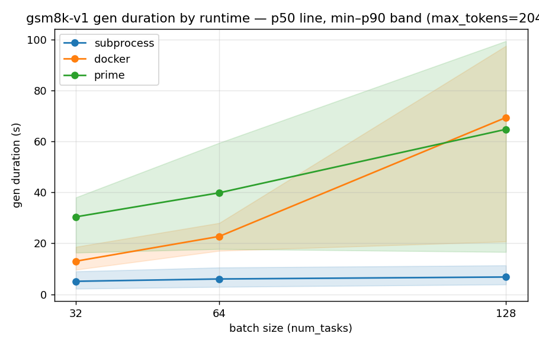
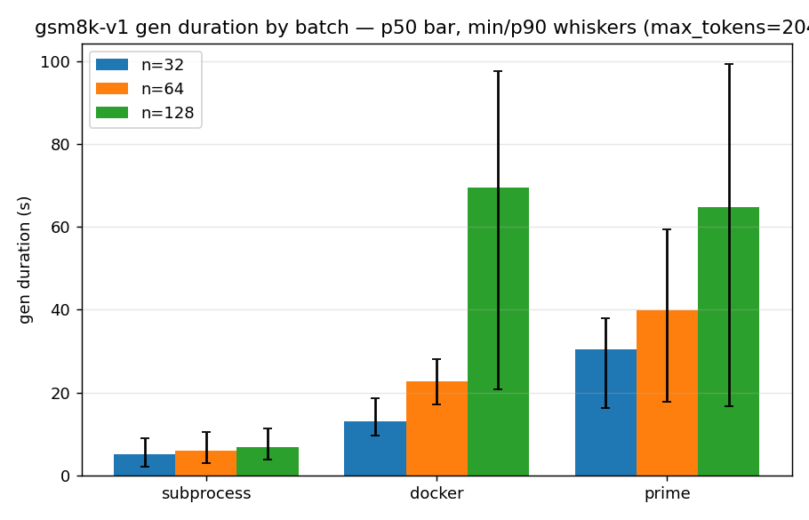

# v1 runtime benchmark — subprocess vs docker vs prime

End-to-end wall-clock comparison of the three v1 runtimes driving the **same**
workload, to measure the overhead each runtime adds.

## Setup

- **Taskset**: `gsm8k-v1`, one rollout per distinct problem (`-r 1`)
- **Harness**: `default`, `enable_bash=false` — held constant; only `runtime.type` varies
- **Model**: `deepseek/deepseek-v4-flash` (eval default) via Prime Inference (`api.pinference.ai`)
- **Concurrency**: `--max_concurrent 512`; **retries off** (`--retry.attempts 1`)
- **Scales (rollouts)**: 32 → 256 → 512
- **Runtimes**: `subprocess` (local process), `docker` (`python:3.11-slim` container/rollout), `prime` (`python:3.11-slim` cloud sandbox + tunnel/rollout)
- Harness git: verifiers `exp/v1-runtime-bench` (off `feat/nano-as-v1`)

`generation.duration` is measured from just before runtime creation to harness end,
so it **includes per-rollout provisioning** (container/sandbox spin-up) — which is
what isolates runtime overhead.

## Start commands

```bash
# subprocess / prime — env sourced (PRIME_API_KEY), from the worktree
uv run eval gsm8k-v1 \
  --harness.id default --harness.enable_bash false \
  --harness.runtime.type <subprocess|prime> \
  --max_concurrent 512 --num_tasks <32|256|512> --num_rollouts 1 \
  --retry.attempts 1 --rich false --output_dir <out>

# docker — same, but the eval needs the `docker` group active:
sg docker -c '... uv run eval ... --harness.runtime.type docker ...'
```

Wrapped by `bench/run_bench.sh <runtime> <num_tasks>`; summarized by `bench/summarize.py`.

## Results — end-to-end wall clock (seconds)

| rollouts | subprocess | docker | prime |
|---:|---:|---:|---:|
| 32  | **14**  | **38**  | **72**  |
| 256 | **149** | **369** | **274** |
| 512 | **306** | **543** | **583** |

All runs completed with **0 failed rollouts**. At 256, **prime (274s) beats docker
(369s)** — docker chokes on 256 local containers, while prime offloads to genuinely
parallel cloud sandboxes.

## Per-rollout detail

`gen_*` = `generation.duration` (provisioning + model call), seconds.

| run | e2e | roll/s | gen_min | gen_p50 | gen_p90 | gen_max | reward | errors |
|---|---:|---:|---:|---:|---:|---:|---:|---:|
| subprocess-32  | 14  | 2.29 | 3.8  | 5.4   | 8.9   | 12.1  | 1.000 | 0 |
| subprocess-256 | 149 | 1.72 | 7.8  | 11.1  | 14.2  | 146.9 | 0.941 | 0 |
| subprocess-512 | 306 | 1.67 | 13.9 | 20.7  | 25.7  | 303.4 | 0.969 | 0 |
| docker-32  | 38  | 0.84 | 11.1 | 13.7  | 19.0  | 34.4  | 0.969 | 0 |
| docker-256 | 369 | 0.69 | 38.4 | 144.5 | 179.4 | 364.6 | 0.961 | 0 |
| docker-512 | 543 | 0.94 | 30.1 | 286.0 | 354.5 | 537.4 | 0.951 | 0 |
| prime-32  | 72  | 0.44 | 21.3 | 27.6  | 34.0  | 62.7  | 0.969 | 0 |
| prime-256 | 274 | 0.93 | 24.8 | 112.2 | 183.3 | 268.6 | 0.949 | 0 |
| prime-512 | 583 | 0.88 | 26.0 | 200.6 | 342.6 | 576.1 | 0.939 | 0 |

Reward is a completion sanity-check only (default sampling temperature → run-to-run noise); not a runtime metric.

## Findings

1. **Fixed provisioning overhead** (`gen_min` at the smallest scale, before the endpoint saturates): subprocess ≈ 0 (3.8 ≈ raw model call), **docker ≈ +7 s/container** (11.1), **prime ≈ +18 s/sandbox+tunnel** (21.3).
2. **The model endpoint is the real bottleneck at high concurrency.** subprocess has ~0 provisioning, yet `gen_min` climbs 3.8 → 7.8 → 13.9 across 32 → 256 → 512 — Prime Inference queueing under concurrent load, a confound shared by all runtimes.
3. **docker degrades sharply at scale** — 256/512 local containers drive `gen_p50` to 144 s / 286 s (vs 13.7 s at 32). Completes cleanly but slowly.
4. **prime scales cleanly and beats docker at 256** by offloading to parallel cloud sandboxes; its per-rollout `gen` rises with concurrency (provisioning + the shared endpoint).

## Capped runs — `max_tokens=2048` (isolating runtime overhead)

The uncapped tails above are dominated by rare long generations (≈1.5% of completions exceed 2048 tokens; p90 is 554), not runtime overhead. Re-running with `--sampling.max_tokens 2048` (`MAX_TOKENS=2048 bench/run_bench.sh <rt> <n>`) trims that straggler tail. Smaller scales (32/64/128), **two passes** each, **0 errors**, rewards unchanged (0.93–1.0; ≤2 truncations/run).

End-to-end wall clock is gated by the single slowest rollout — an endpoint-queue straggler can
sit for minutes even on a capped generation — so it's a noisy comparator the max hides. The
robust view is the per-rollout **generation-duration distribution** (min / p50 / p90, pooled
over both passes; `bench/plot_e2e.py`):




generation duration (s) — min / p50 / p90 at batch 32 / 64 / 128:

| runtime | min | p50 | p90 |
|---|---|---|---|
| subprocess | 2 / 3 / 4    | 5 / 6 / 7    | 9 / 11 / 11  |
| docker     | 10 / 17 / 21 | 13 / 23 / 69 | 19 / 28 / 98 |
| prime      | 16 / 18 / 17 | 30 / 40 / 65 | 38 / 59 / 99 |

`prime`'s **min is flat (~17s)** — its fixed sandbox+tunnel provisioning floor — while p50/p90
climb with concurrency, i.e. the growth is endpoint queueing, not runtime overhead.

- **Capping removes the straggler tail**: docker-128 drops 319 → ~134 s and prime-128 413 → ~178 s vs the uncapped runs — confirming much of the earlier tail was generation length, not runtime overhead.
- **Provisioning ordering holds**: subprocess (≈0) < docker (per-container) < prime (per-sandbox+tunnel), widening with scale.
- **subprocess is endpoint-bound and noisy** — the 64 < 32 dip is endpoint variance; with ~0 provisioning its wall clock ≈ model latency.
- **prime variance is highest at 128** (124 vs 232 s across passes) — the 100 tunnels/min cap biting unevenly.

`bench/plot_e2e.py` regenerates both graphs from the `BENCH` lines.

## Next

- **endpoint**: it dominates wall clock at 512 concurrency — re-measure against a higher-throughput inference deployment to separate runtime overhead from model latency.
