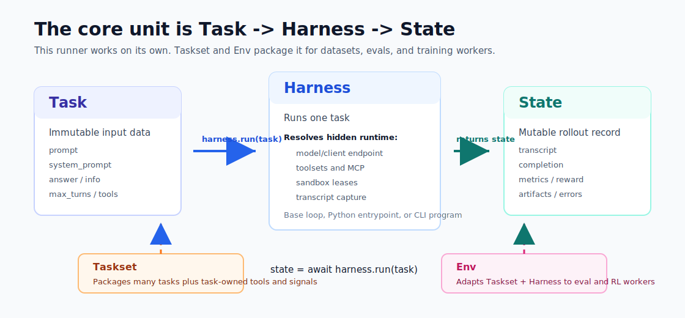
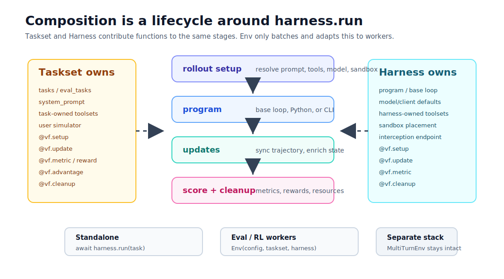

# BYO Harness

BYO Harness is the preferred `verifiers.v1` Taskset/Harness authoring path for
new environments that need a clean separation between the task being attempted
and the way a model attempts it.

Use this path when you want to bring your own harness: a tool loop, CLI program,
third-party Python program, sandboxed program, user simulator, MCP server, or
nested sub-harness workflow. For simple one-off environments, the core
[Environments](environments.md) guide remains the shortest path.

## Core Shape



v1 environments are composed from:

- `Taskset`: task rows, task-owned tools, user behavior, metrics, rewards, and
  cleanup;
- `Harness`: rollout behavior, model endpoint forwarding, program execution,
  harness-owned tools, sandboxes, and nested harness calls;
- `Env`: adapter that makes a taskset/harness pair usable by eval and training
  workers.

The smallest v1 environment only needs a taskset. If no harness is passed,
`vf.Env` uses the base endpoint-backed harness.

```python
import verifiers.v1 as vf


def source():
    yield {
        "system_prompt": "Reverse text exactly.",
        "prompt": [{"role": "user", "content": "Reverse abc."}],
        "answer": "cba",
        "max_turns": 1,
    }


@vf.reward(weight=1.0)
async def contains_answer(task, state) -> float:
    return float(task["answer"] in str(state.get("completion") or ""))


def load_taskset(config: vf.TasksetConfig | None = None):
    return vf.Taskset(source=source, rewards=[contains_answer], config=config)


def load_environment(config: vf.EnvConfig | None = None):
    config = config or vf.EnvConfig()
    return vf.Env(taskset=load_taskset(config=config.taskset))
```

## Tasksets

`Taskset(source=...)` accepts either a direct iterable of rows or a zero-argument
loader. Direct iterables are fine for tiny examples. Real tasksets should use a
zero-argument loader so imports and constructors stay cheap.

```python
from datasets import load_dataset
import verifiers.v1 as vf


class GSM8KTasksetConfig(vf.TasksetConfig):
    dataset_name: str = "gsm8k"
    split: str = "train"


def load_taskset(config: vf.TasksetConfig | None = None):
    config = GSM8KTasksetConfig(config)
    dataset_name = config.dataset_name
    split = config.split

    def source():
        dataset = load_dataset(dataset_name, "main", split=split)
        for index, row in enumerate(dataset):
            yield {
                "example_id": index,
                "prompt": [{"role": "user", "content": row["question"]}],
                "answer": row["answer"],
            }

    return vf.Taskset(source=source, config=config)
```

Source rows are JSON-serializable mappings. Config is resolved before source
loading and closed over by the loader; trainers and harnesses do not pass
runtime values into source.

Do not use a top-level string `task` field for routing. v1 tasksets serialize
the full task payload through `info["task"]` for worker compatibility, and
environment routing uses `info["env_id"]`.

## Task Controls

Tasks can request rollout behavior through top-level serializable fields:

- `max_turns`: per-rollout turn limit for the base harness loop;
- `tools`: tool visibility as `{"show": [...]}` or `{"hide": [...]}`;
- `toolsets`: toolset visibility or rollout-local toolsets;
- `sandbox`: per-task overrides for a sandboxed program;
- `program`: per-task files, dirs, env, setup, artifacts, bindings, and command
  args.

Priority is:

```text
explicit state.runtime > task top-level controls > harness defaults
```

Keep system instructions out of `prompt`. v1 resolves `system_prompt` from the
task, taskset, and harness as a separate field; the base harness concatenates
the resolved system messages with `prompt` only when it submits a model request.
If more than one source provides a system prompt, resolution fails unless the
harness explicitly sets a merge policy.

`state.runtime` comes from explicit standalone state passing, `Taskset.init_group`
customization, or eval/training model controls. For normal tasksets, use
top-level task controls:

```python
yield {
    "prompt": [{"role": "user", "content": "Use the search tool."}],
    "max_turns": 5,
    "tools": {"show": ["search"]},
}
```

`task.runtime` is not part of the public task schema. Runtime metadata lives on
`state.runtime` and is written by the harness, the taskset group initializer, or
the eval/training worker.

Use `task.program` when a taskset owns files or environment variables that a
reusable harness should consume. The taskset cannot change the harness command
or tool interface; duplicate keys across the taskset and harness fail.

## Toolsets

Tools are packaged as `Toolset` objects. A taskset can own tools directly:

```python
async def search(query: str, index) -> str:
    return index.search(query)


toolset = vf.Toolset(
    tools=[search],
    objects={"index": load_index},
    bindings={"search.index": "objects.index"},
)

taskset = vf.Taskset(source=source, toolsets=[toolset])
```

Bindings inject hidden arguments that the model does not see. Common binding
roots are `task.*`, `state.*`, and `tools.*`. Tool and user callables can also
bind `objects.*` from their own private dependency factories.

MCP servers are also tools:

```python
taskset = vf.Taskset(
    source=source,
    toolsets=[
        vf.Toolset(
            tools=[vf.MCPTool(command="uvx", args=["mcp-server-fetch"])]
        )
    ],
)
```

## Harnesses

Create a harness when rollout behavior is no longer just "call the model with
the resolved taskset tools."

```python
def load_harness(config: vf.HarnessConfig | None = None):
    return vf.Harness(
        program={"fn": "my_env.program:run"},
        config=config,
    )


def load_environment(config: vf.EnvConfig | None = None):
    config = config or vf.EnvConfig()
    return vf.Env(
        taskset=load_taskset(config=config.taskset),
        harness=load_harness(config=config.harness),
    )
```

`Harness.program` can be:

| Form | Meaning |
| --- | --- |
| `None` | default endpoint-backed tool loop |
| callable | Python program called in-process |
| `{"fn": "pkg.module:run"}` | importable Python program |
| `{"command": ["cmd", "arg"]}` | local or sandboxed command |
| `{"sandbox": True}` | sandboxed default loop |

All model calls go through the v1 interception endpoint so trajectory capture,
tool forwarding, and protocol translation share one path.

Sandbox command programs can request the resolved tools as an MCP server with
`program={"command": [...], "sandbox": True, "tools": "mcp"}`. Python programs
receive callable tool handles by default, or can set
`program={"sandbox": True, "tools": "callable"}` when the base loop is moved
into a sandbox.

Programs are also the right shape for LLM-free replay:

```python
async def replay_solution(task, state):
    state["answer"] = task["answer"]
    state.stop("replayed")
    return state


@vf.reward
async def exact(task, state) -> float:
    return float(state.get("answer") == task.get("answer"))


def load_environment():
    taskset = vf.Taskset(source=load_rows, rewards=[exact])
    return vf.Env(taskset=taskset, harness=vf.Harness(program=replay_solution))
```

Use this for cached completions, deterministic solvers, and gold-solution
validation. Subclass `Harness` only when packaging reusable behavior with a new
config surface; do not subclass `Env` just to bypass inference.

Packaged CLI harnesses should use the same boundary. These implementations live
under `verifiers.v1.packages` while the v1 surface stabilizes, and are
re-exported through `verifiers.v1`. `CLIHarness` is the generic command wrapper;
`OpenCode`, `Pi`, `MiniSWEAgent`, and `RLM` are bundled leaf wrappers:

```python
def load_environment():
    return vf.Env(
        taskset=vf.HarborTaskset(tasks="/path/to/harbor/tasks"),
        harness=vf.OpenCode(),
    )
```

`HarborTaskset` owns Harbor task loading, sandbox overrides, task uploads, and
test scoring. CLI harnesses own CLI installation/config/run behavior and work
with any taskset that supplies a prompt.

## Setup, Updates, Signals, And Cleanup



Setup functions, update functions, metrics, rewards, and advantages are
lifecycle functions around program execution and the rollout/group scoring
boundary.

```python
@vf.metric
async def turns(task, state) -> float:
    return float(len(state["trajectory"]))


@vf.reward(weight=1.0)
async def correct(task, state) -> float:
    return float(task["answer"] in str(state.get("completion") or ""))


@vf.reward(stage="group")
async def best_of_n(tasks, states) -> list[float]:
    ...
```

Rollout signals accept `task, state`, plus any Toolset-bound hidden args. Group
signals accept exactly `tasks, states` and return one value per state. Setup
functions use `@vf.setup` and run before the program body; update functions use
`@vf.update` and run before scoring; cleanup functions use `@vf.cleanup` and run
after scoring; teardown functions use `@vf.teardown`.

For sandbox command/Python programs, program files, directories, setup commands,
state handoff, and tool-interface setup are framework setup contributions with
fixed priorities. User `@vf.setup(priority=...)` handlers can intentionally run
before or after those built-ins without adding new lifecycle hooks.

`env.requires_group_rollouts` is true when group-stage updates, scoring,
cleanup, or group setup are part of the environment contract.
`env.provides_advantages` is true when the environment has explicit advantage
handlers.

## TOML Config

Eval and RL TOML own the outer run: model, endpoint, sampling, rollout count,
and trainer/eval settings. v1 config owns taskset and harness behavior inside
the environment package. Put taskset and harness config next to the environment
entry; a top-level `[harness]` table acts as the default for every environment.

The recommended loader takes one `config` object and routes its `taskset` and
`harness` sections:

```python
def load_environment(config: vf.EnvConfig | None = None):
    config = config or vf.EnvConfig()
    return vf.Env(
        taskset=load_taskset(config=config.taskset),
        harness=load_harness(config=config.harness),
    )
```

Eval config passes named environment args through `args` and v1 config through
the `taskset`/`harness` sections. A top-level `[harness]` table is used by
every `[[eval]]`:

```toml
model = "openai/gpt-5.4-mini"
num_examples = 5
rollouts_per_example = 3

[harness]
max_turns = 4

[[eval]]
env_id = "my-v1-env"
sampling_args = { max_tokens = 4096 }

[eval.taskset.scoring.exact_answer]
weight = 0.5
```

For concise v0-style named args, pass typed child config objects as defaults.
Explicit `taskset`/`harness` sections stay the most specific source and override
those defaults.

```python
class MyTasksetConfig(vf.TasksetConfig):
    split: str = "train"


def load_taskset(
    split: str | None = None,
    config: vf.TasksetConfig | None = None,
):
    config = MyTasksetConfig(config, split=split)
    ...


def load_harness(
    max_turns: int | None = None,
    config: vf.HarnessConfig | None = None,
):
    config = vf.HarnessConfig(config, max_turns=max_turns)
    ...


def load_environment(
    config: vf.EnvConfig | None = None,
    split: str = "train",
    max_turns: int = 10,
):
    config = vf.EnvConfig(
        config,
        taskset=MyTasksetConfig(split=split),
        harness=vf.HarnessConfig(max_turns=max_turns),
    )
    return vf.Env(
        taskset=load_taskset(config=config.taskset),
        harness=load_harness(config=config.harness),
    )
```

RL and Hosted Training config uses the same shape under `env`; the top-level
`[harness]` table is shared by every `[[env]]`:

```toml
model = "Qwen/Qwen3-30B-A3B-Instruct-2507"
max_steps = 100
batch_size = 256
rollouts_per_example = 8

[sampling]
max_tokens = 4096

[harness]
max_turns = 8

[[env]]
id = "primeintellect/my-v1-env"

[env.args]
arg1 = "non-th-arg"

[env.taskset.toolsets.search]
tools = ["my_env.tools:search"]
bindings = { "search.index" = "objects.index" }
```

Callable config uses `fn = "module:callable"` when metadata is needed:

```toml
[[env.taskset.rewards]]
fn = "my_env.signals:exact_answer"
weight = 1.0
priority = 0
```

The callable name is always its Python function name. Use
`[...scoring.function_name]` to tune or skip an existing metric/reward without
creating a new signal.

For command harnesses, keep endpoint and tool registration under the requested
`program.tools` interface:

```toml
[env.harness.program]
command = ["my-cli", "run", "--config", "/tmp/my-cli.json"]
sandbox = true

[env.harness.program.tools]
mcp = { fn = "my_env.cli:write_cli_config" }

[env.harness.program.bindings]
"write_cli_config.endpoint_config" = { fn = "my_env.cli:endpoint_config" }
```

The implementation details for TOML refs, toolset tables, source loaders,
program bindings, and custom config subclasses are in
`verifiers/v1/README.md`.

## When To Use Which Path

Use the core `SingleTurnEnv`, `ToolEnv`, and `MultiTurnEnv` docs when you want
the shortest path through the established environment classes.

Use BYO Harness when you want reusable tasksets, reusable harnesses, task-owned
or harness-owned toolsets, third-party Python programs, sandboxed programs,
stateful users, MCP tools, or nested harness calls.

The repository also includes a deeper implementation guide at
`verifiers/v1/README.md`.
