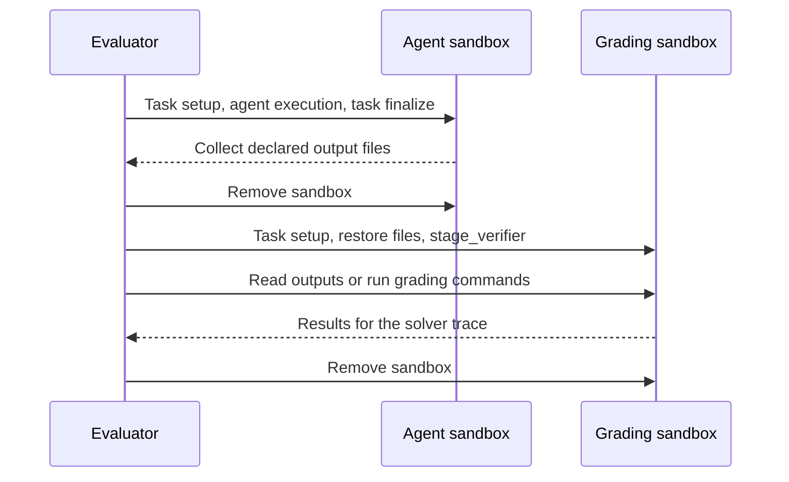

# Building Environments

An environment package defines the tasks an agent receives, the files and tools
it can use, and how its work is scored. Start with a `Taskset` and a `Task`; add a
custom `Env` only when you need control flow the built-in environments do not cover.

## Choose where the work runs

| Part | Where it runs | What it owns |
| --- | --- | --- |
| Evaluator | The machine running `vf-eval` or an environment worker | Dataset loading, Python task hooks, agent coordination, traces, and scoring logic |
| Agent sandbox | The agent's configured runtime | The harness, task files, and commands the agent executes |
| Grading sandbox | A fresh runtime when using isolated verification | A clean task setup, copied output files, and verifier-only dependencies or tests |
| Task tools | Their configured runtime, or the agent sandbox with `colocated = true` | MCP server processes and their state |

Python task hooks always execute on the evaluator. A call to `runtime.read()` or
`runtime.run()` operates in the supplied sandbox; `Path.read_text()` reads on the
evaluator. During isolated scoring, the supplied runtime is the grading sandbox.

For answer-only tasks, ordinary `@vf.reward` methods and the default
`SingleAgentEnv` are enough. For file-based work, decide whether scoring should
use the agent's existing filesystem or a fresh sandbox. The
[runtime matrix](runtimes.md#capability-matrix) covers backend support.

## Create a package

```bash
uv run vf-init file-sum-v1
```

The scaffold creates `environments/file_sum_v1/` with a `pyproject.toml` and a
`file_sum_v1` Python package. Put task data, hooks, and scoring in `taskset.py`.
Export the taskset and, when needed, an environment from `__init__.py`.

Keep dataset choices on `TasksetConfig`, task settings on `TaskConfig`, and saved
per-task values on `TaskData`. Implement `Taskset.load()`, not `__init__`. See
[tasksets](tasksets.md) for dataset loading, judges, images, and custom tools.

## Load an existing benchmark

Load datasets in `Taskset.load()` on the evaluator. For Hugging Face datasets,
pass the package's dataset, split, and revision settings to `load_dataset`.
Apply benchmark-specific filters before yielding tasks; use the evaluation's
`select` config for sampling. Preserve the source prompts, reference answers,
image order, and scoring rules. Put extra reference fields on a `TaskData`
subclass; they are not automatically added to the agent's messages.

Set `TaskData.id` from a stable source identifier. Let Verifiers assign `idx`,
which is the position in the loaded task stream. Pin the dataset revision and
image reference when results must be reproducible. See
[task identity](tasksets.md#task-identity) for stable keys across reordered data.

Dataset caches and package files live on the evaluator. They do not appear in a
remote sandbox automatically. Copy agent-visible inputs with `runtime.write`
during `setup`, or include large assets in the task image. Copy private grader
files only during `stage_verifier`. Include those files in the installed package,
and read them with `importlib.resources` instead of relying on the current directory.
The [dependency guide](runtimes.md#packaged-grader-scripts) explains which Python
environment needs each dependency.

These `prime-envs` packages show common patterns. Check their declared Verifiers
version before adapting them; use the APIs documented here for this version.

| Pattern | Example | Guide |
| --- | --- | --- |
| Large context files and answer files | [GraphWalks](https://github.com/PrimeIntellect-ai/prime-envs/tree/main/environments/long_context/graphwalks) | [File answers](tasksets.md#file-answers-and-shared-scoring-inputs) |
| Read an answer once for several scores | [LongBench-Pro](https://github.com/PrimeIntellect-ai/prime-envs/tree/main/environments/long_context/longbenchpro) | [Shared scoring inputs](tasksets.md#file-answers-and-shared-scoring-inputs) |
| Packaged Python grader | [HumanEval](https://github.com/PrimeIntellect-ai/prime-envs/tree/main/environments/code/humaneval) | [Grader dependencies](runtimes.md#packaged-grader-scripts) |
| Tool state used by task scoring | [Wikispeedia](https://github.com/PrimeIntellect-ai/prime-envs/tree/main/environments/reasoning/wikispeedia) | [Stateful tools](tasksets.md#stateful-tools) |
| Harness defaults selected by task settings | [HLE-Diamond](https://github.com/PrimeIntellect-ai/prime-envs/tree/main/environments/knowledge/hle_diamond) | [Role defaults](env.md#role-defaults) |
| Scripted user messages in one rollout | [BFCL v3](https://github.com/PrimeIntellect-ai/prime-envs/tree/main/environments/tool_use/bfcl_v3), [SciCode](https://github.com/PrimeIntellect-ai/prime-envs/tree/main/environments/code/scicode) | [Scripted conversations](env.md#scripted-conversations) |

## Separate agent and grading sandboxes

Use `IsolatedVerifierEnv` for deterministic grading in a fresh runtime. It runs
one agent, transfers the declared outputs, then adds task rewards and metrics to
that agent's trace. The grader does not need a second model.



For example, replace the scaffold's `taskset.py` with:

```python
import verifiers.v1 as vf


class FileSumTask(vf.Task[vf.TaskData]):
    NEEDS_CONTAINER = True

    async def setup(self, runtime: vf.Runtime) -> None:
        await runtime.write("/app/input.txt", b"1\n2\n3\n")
        await runtime.write("/app/output/answer.txt", b"")

    @vf.reward
    async def correct(self, runtime: vf.Runtime) -> float:
        answer = await runtime.read("/app/output/answer.txt", max_bytes=1024)
        return float(answer.strip() == b"6")

    async def validate(self, runtime: vf.Runtime) -> bool:
        await runtime.write("/app/output/answer.txt", b"6\n")
        return bool(await self.correct(runtime))


class FileSumTaskset(vf.Taskset[FileSumTask, vf.TasksetConfig]):
    def load(self) -> list[FileSumTask]:
        return [
            FileSumTask(
                vf.TaskData(
                    prompt=(
                        "Sum the integers in /app/input.txt. Write only the sum "
                        "to /app/output/answer.txt."
                    ),
                    image="python:3.11-slim",
                    workdir="/app",
                    artifacts=[vf.Artifact(source="/app/output")],
                ),
                self.config.task,
            )
        ]
```

The empty answer file makes an untouched task score zero. `setup` runs in both
sandboxes; restoring the solver's output replaces that empty file in the grader.
The gold check writes a known answer and uses the same reward method.

Select the environment by exporting it in `file_sum_v1/__init__.py`:

```python
from verifiers.v1.envs.isolated_verifier import IsolatedVerifierEnv

from file_sum_v1.taskset import FileSumTaskset

__all__ = ["FileSumTaskset", "IsolatedVerifierEnv"]
```

Alternatively, select it at evaluation time with `--env.id isolated-verifier`.
Without either selection, the default environment scores inside the agent's
runtime. Harbor packages should export `HarborEnv` and use Harbor's
[separate-verifier declaration](harbor.md#separate-verifier-environments).

### Choose a different grading runtime or image

Save an evaluation config such as `configs/file-sum.toml`:

```toml
model = "z-ai/glm-5.2"

[env.taskset]
id = "file-sum-v1"

[env.agent.harness]
id = "bash"

[env.agent.runtime]
type = "docker"
cpu = 2
memory = 4

[env.verifier.runtime]
type = "docker"
image = "python:3.11-slim"
cpu = 1
memory = 1
```

Omit `env.verifier.runtime` to create a fresh copy of the solver's resolved
runtime settings. When supplied, it is an independent runtime config: configure
its backend, resources, and network settings as needed. It can use a different
backend from the solver. An explicitly supplied verifier `image` overrides the
task image, so the grader can contain dependencies absent from the solver.
Build and publish custom images before evaluation.

`env.verifier.env` replaces the task's `runtime_env()` values for verifier
processes. Config values are saved, so keep secrets out of that field.

Both sides must use container runtimes; `subprocess` is refused for artifact
collection and isolated grading. Use absolute artifact paths if the two runtimes
have different workdirs. Relative paths require matching workdirs.

### Transfer outputs and prepare private tests

Declare every output needed for grading in `TaskData.artifacts`, using files or
directories. Paths are restored at the same locations, replacing existing
contents under each declared root. Keep these roots separate from trusted tests
and grader dependencies. A missing required artifact fails the rollout; use
`vf.Artifact(source=..., required=False)` for an optional output and handle its
absence in scoring. Directory artifacts can use `exclude` patterns.

`/logs/artifacts` is collected automatically when present. The total archive
limit is 32 MiB by default, controlled by `TaskData.artifact_max_bytes`. Archives
stay in evaluator memory during grading; they are not saved in traces. Save
small evidence needed later in `trace.info` during `finalize`.

Use `stage_verifier` for private inputs needed by a grader program. It runs after
artifact restoration and only in the grading sandbox. For example, a task with
packaged tests can add this hook:

```python
from importlib.resources import files


async def stage_verifier(self, runtime: vf.Runtime) -> None:
    tests = files("file_sum_v1").joinpath("private_tests.py").read_bytes()
    await runtime.write("/tests/check.py", tests)
```

Package `private_tests.py` with the evaluator code and run it from the reward
method using `runtime.run`. Keep it out of the solver image, solver setup, and
declared artifacts. Install grading dependencies in the verifier image or this
hook. Task `setup` also runs in the solver, so it must only prepare inputs the
agent may see. Restrictions start after setup and staging; task and verifier
network policies still combine as described in [runtimes](runtimes.md#network-policies).

Task `finalize` runs in the solver before collection. Harness metrics are recorded
there; task metrics and rewards are deferred to the verifier. Configured task
judges that call models are rejected by `isolated-verifier`. Grading failures
retry in a fresh sandbox according to `env.verifier.retries` (default: 2 extra
attempts). A returned zero reward is a completed grade, not a retryable failure.

## Add other behavior

| Need | Use |
| --- | --- |
| Extra task-specific tools | Scaffold with `vf-init -T`; configure their runtime or set `colocated = true` to share the agent sandbox |
| Several attempts or a model judge | `best-of-n`, `agentic-judge`, or `shared-agentic-judge` |
| A model playing the user | `user-sim` |
| A game or scripted follow-up messages | A custom `Env.run()` driving `agents.<role>.interaction(task)` |
| Several services, such as an app and database | A Harbor task with Compose and `HarborEnv` |
| A different agent program | A built-in harness, or `vf-init -H` for a custom one |

See [environment control flow](env.md#custom-control-flow),
[task tools](tasksets.md#adding-tools), and [harnesses](harnesses.md). A custom
environment's `finalize(task, episode)` runs after agent-owned runtimes are
released; use saved trace evidence there.

## Check the environment

Install the package in the CLI's Python environment, then check it:

```bash
uv pip install -e environments/file_sum_v1
uv run vf-eval @ configs/file-sum.toml --dry-run
uv run vf-validate file-sum-v1 --runtime.type docker -n 1
uv run vf-eval @ configs/file-sum.toml -n 1 -r 1 -c 1 --no-push
```

For this example, validation checks that the gold answer passes and the untouched
answer fails. The evaluation exercises the full sandbox transfer and grading
lifecycle. Inspect its trace for the reward and any setup or scoring
error before increasing the run size.

`vf-validate` checks tasks directly; it does not run `Env`, transfer artifacts,
or call `stage_verifier`. If a gold check needs private staging, call it from
`validate`. The default noop check also lacks that staging, so tasks whose reward
requires it need a separate untouched-output check through their grading path.
See [validation and trace inspection](debugging.md).
