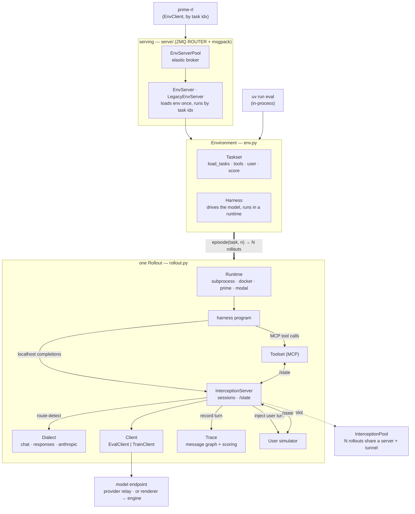
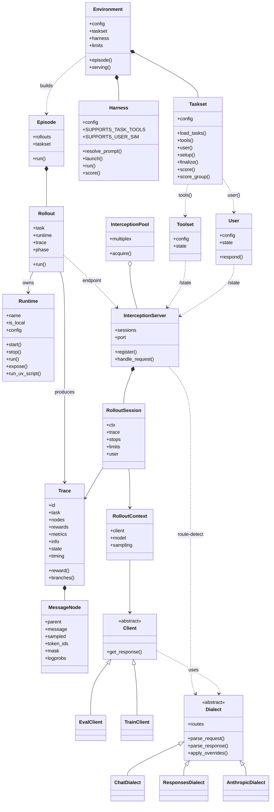
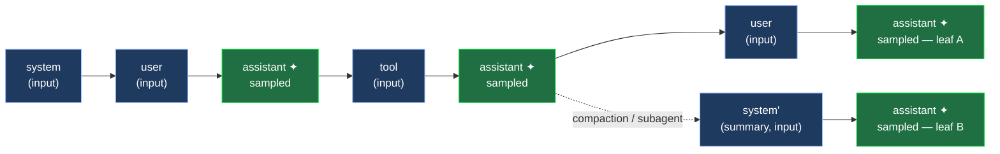

# verifiers.v1 — architecture

How v1 is built and why, for people working *on* the framework. For how to *use* it, see the
[README](README.md) and the [user guide](GUIDE.md). Names below are real; paths are relative
to `verifiers/v1/`.

## The shape of it

A rollout is the composition of three independently-swappable pieces, each loaded by `id`:

- **Taskset** — data + scoring. Produces typed `Task`s; owns `@reward`/`@metric`/`@group_reward`
  and the lifecycle hooks.
- **Harness** — the program that drives the model turn to turn.
- **Runtime** — *where* that program (and the taskset's tools / user simulator) executes.

`Environment` (`env.py`) wires them together for an eval; `Rollout` (`rollout.py`) runs one
trajectory; `Episode` (`episode.py`) runs a task's N rollouts and applies cross-rollout
scoring. The single artifact every layer produces and consumes is a **`Trace`** — a typed
message graph (`graph.py`, `trace.py`).

The load-bearing design idea: **a harness only ever points its model SDK at a localhost
endpoint** — in whatever wire dialect it natively speaks (chat-completions, Responses,
Anthropic, ...) — and the framework intercepts every call behind that endpoint
(`interception/`). A `dialect` layer route-detects the format, so everything else the
framework does — building the trace, capturing tokens, enforcing budgets, injecting a user
simulator — is invisible to the harness, which stays a plain program.

The pieces, and how they interact (everything inside *one Rollout* is per-trajectory):



And what each component holds and how it relates (associations are runtime references,
diamonds are ownership):



At run time, that composition unfolds as a staged, individually-bounded lifecycle:

```
Episode (task, n)
└─ Rollout.run()                              # rollout.py, one asyncio.Task per rollout
   ├─ runtime.start()                         # provision workspace / container / sandbox
   ├─ taskset.setup(task, runtime)            # Phase.SETUP   — wait_for(setup_timeout)
   ├─ harness.run(ctx, trace, runtime, …)     # Phase.RUNNING — wait_for(rollout_timeout)
   │     └─ model calls → interception server → client → graph.prepare_turn()+commit()
   ├─ taskset.finalize(task, trace, runtime)  # Phase.FINALIZE— wait_for(finalize_timeout)
   ├─ taskset.score + harness.score           # Phase.SCORING — wait_for(scoring_timeout)
   └─ runtime.stop()                          # guaranteed teardown (also atexit-guarded)
   ⤷ Episode then runs @group_reward across the task's N traces
```

Each stage is bounded by its own `asyncio.wait_for` (`rollout.py`), so a wedge in any one
phase is a budget event, not a hang — a `harness_timeout` scores what's there; a
`finalize`/`scoring` timeout errors the rollout. Defaults are no-limit, so production configs
set `TimeoutConfig` explicitly. Retries wrap the loop at two granularities: per-call
(`RetryingClient`, `RetryingRuntime` — rerun just the failed model/runtime call, keeping
progress) and whole-rollout (`retries.py::run_with_retry` — re-run if the trace ends in a
retryable error type). Per-rollout budgets (`RolloutLimits`) are checked between turns.

## The trace is a message graph

A `Trace` stores each message **once**, as a `MessageNode` (`graph.py`) linked to its
predecessor (`parent: int | None`). A node carries the message plus its training payload:
`token_ids` (this node's delta tokens — leading scaffold + own tokens), a per-token trainable
`mask`, `logprobs`, `sampled` (did the model produce it?), `finish_reason`, optional
`multi_modal_data`, optional `routed_experts` (the MoE router-replay slice for this node's
tokens), and transient `usage`.



Each leaf is one branch (one training sample); `✦` marks a model-sampled node. Storing
deltas, not full conversations, is what makes the trace **linear in turns, not
quadratic** — and it's what makes branching first-class. `prepare_turn()` then `commit()`
(`graph.py`) insert a turn by *reusing* any existing prefix node whose `(parent, message_hash)`
matches, and only creating nodes for genuinely new messages. `message_hash()` canonicalizes role + content
(+ `reasoning_content` for assistants, + tool calls with canonical-JSON args + `tool_call_id`
for tools), so identical prefixes collapse and forks share their common history.

A **`Branch`** (`trace.py`) is a root→leaf path. `Trace.branches` walks the graph's leaves
back to roots; a linear harness yields one branch, a compacting or multi-agent harness yields
several. A branch *is* a training sample: concatenating its nodes' `token_ids` reconstructs
`prompt_ids + completion_ids`, its `mask` marks exactly the sampled positions, and its
`logprobs` line up — no agent-specific export code. This is why compaction and subagents train
end to end: each surviving context window is just another root→leaf path.

`Trace.to_wire()` (`trace.py`) is `model_dump` minus what shouldn't travel: computed views
(`reward`, `branches`, `num_turns`), per-span `duration`s (recomputed on the far side), and
`usage`. Multimodal pixel tensors and `routed_experts` *do* travel — serialized to raw bytes
(msgpack `bin`) by field serializers on `MessageNode` (`graph.py`), and the trace is dumped in
`mode="python"` (not JSON) so the numpy arrays ride the env-server wire to the trainer untouched.

### Branching: message-level vs renderer-level, and the token invariant

The graph guarantees one **invariant**: walking any leaf back to the root and concatenating node
`token_ids` reproduces *exactly* the `prompt_ids + completion_ids` the inference engine saw and
produced for that trajectory. Everything below exists to keep that true, turn after turn.

A turn is committed in two steps (`graph.py`). `prepare_turn(trace, prompt)` walks the graph once,
reusing the longest prefix whose `(parent, message_hash)` matches — the *message-level* prefix.
`commit(response)` then attributes only the new tail. There are two distinct ways a turn can fail
to extend the previous one linearly — two true kinds of branching:

- **Message-level branch** — the harness rewrites the message *sequence* (compaction drops history
  for a notes summary; a subagent runs its own context). The messages genuinely differ, so
  `message_hash` diverges and the graph forks, sharing the common prefix. This needs no token ids,
  so it surfaces under both the eval relay and the train client. Canonical example: the `compact`
  harness (a fresh `[system, notes]` every turn → one branch per turn).
- **Renderer-level break** — the message sequence is *unchanged* but the renderer **retokenizes**
  the prior turn, so the tokens drift while `message_hash` stays identical: BPE drift, a rewritten
  tool call, or a chat template that **drops a prior assistant's `<think>` across a user turn**
  (Qwen3.5 does this; it *preserves* thinking between tool calls, so agentic tool loops are
  unaffected). Message-hash dedup is blind to this — it would silently reuse the stale prefix
  tokens and corrupt the invariant. So `commit` *tightens* the message-hash prefix to **token
  identity** when token ids are present: it takes the longest common token prefix of the stored
  prefix vs this turn's `prompt_ids` (comparing the concatenation, not per-message spans — a prior
  assistant's stored generation form and its re-rendered input form place the turn-close scaffold
  in different nodes but at the same position, so only a real content change shifts the prefix) and
  forks at the first divergence. Each resulting branch is token-consistent; the invariant holds.
  This is detectable **only at the token level** — the eval relay carries no token ids and falls
  back to message-hash, so a renderer-level break is invisible to it.

The renderer client avoids the break entirely when it can: instead of re-rendering the whole prompt
each turn, the train client (`clients/train.py`) calls `renderer.bridge_to_next_turn(...)`, which
keeps the prior `prompt_ids + completion_ids` **verbatim** and only renders the new tail. Verbatim
prior ⇒ the stored prefix matches token-for-token ⇒ no fork, one linear branch, invariant intact.
The token-identity check in `commit` is the backstop for when the bridge can't apply (the renderer
returns `None`, multimodal, the eval relay): the break still surfaces as honest branches rather than
silent corruption.

## Model access — interception, dialects, clients

When the harness POSTs a completion to its localhost endpoint, the `InterceptionServer`
(`interception/server.py`) routes by the per-rollout bearer secret to a `RolloutSession`, then,
per turn: checks `refused()` (the rollout's `RolloutLimits` + the taskset's `@stop`s), calls
the session's client, records the result with `graph.prepare_turn()` + `commit()`, and — if the
taskset has a user simulator — appends the next user message and loops, all invisibly to the harness.

The wire format is abstracted by a **`Dialect`** (`dialects/`), chosen by the request's route:
`ChatDialect` (OpenAI chat-completions), `ResponsesDialect`, `AnthropicDialect`. A dialect
knows how to parse a wire request into a typed prompt, parse a response (or a complete SSE
stream) back into a `Response`, inject the eval's model + sampling, and extend the body for a
user-sim turn — so reasoning content and streaming are preserved across providers.

Behind the endpoint sits one of two clients:

- **`EvalClient`** (`clients/eval.py`) — a 1:1 relay. Forwards the body to the provider,
  parses the response through the dialect, keeps the raw response. Text in, text out; the
  trace's tokens are whatever the provider reports.
- **`TrainClient`** (`clients/train.py`) — a renderer. Tokenizes the prompt client-side
  (the `renderers` package), calls the engine's `/inference/v1/generate`, and gets exact
  `token_ids` + `logprobs` per turn onto the node. This is what makes a rollout directly
  trainable.

Interception servers are pooled and multiplexed (`interception/pool.py`): one `PooledServer`
serves up to `multiplex` concurrent rollouts (each with its own secret) behind a single tunnel,
and the pool brings up more elastically — so thousands of concurrent rollouts don't mean
thousands of servers or tunnels.

## Runtimes

A `Runtime` (`runtimes/base.py`) is the single contract for *where* code runs:
`start`/`stop`/`cleanup`, `run(argv, env)` and `run_background(...)`, `run_uv_script(...)`,
`read`/`write`, and `expose(port)` (the URL by which the host reaches a port inside the
runtime — localhost for subprocess, a tunnel for prime/modal). The same contract backs the
harness, a task's tool servers, and the user simulator, so any of them runs in any backend:
`subprocess` (local, `/tmp/<name>` workspace, own process group), `docker` (local container),
`prime` (remote sandbox), `modal` (remote function).

Resources are named after the rollout id (greppable) and their teardown is guaranteed: a live
runtime registers in a `WeakSet`, and an `atexit` hook reaps anything a signal-interrupted
`finally` didn't. `run_uv_script` runs a PEP 723 single-file script with inline deps — the unit
tools and in-runtime scoring are built from, so a dependency (a tool server, a `math-verify`
scorer) never touches the eval process. (The subprocess runtime resolves each script's
interpreter once and caches it, keeping `uv` off the per-rollout hot path.)

Tools and the user simulator are structurally the same thing — an MCP server launched in a
runtime and reached over the resolved URL. Placement (colocated in the harness's runtime, its
own per-rollout runtime, a shared one built once, or an existing remote) is config, and
reachability is resolved automatically.

## Serving — the orchestrator interface

`uv run eval` runs rollouts in-process. For training, the same `Environment` is served:
`EnvServer` (`serve/server.py`) loads the environment and its tasks once, then handles each
request as **one `asyncio.Task` per rollout** over a ZMQ ROUTER socket, msgpack frames
(`[client_id, request_id, method, payload]`). Methods are `health` / `info` /
`run_rollout` / `run_group` (`run_group` is one `Episode` so cross-rollout scoring works
server-side). An `EnvClient` (`serve/client.py`) on a DEALER socket drives the server **by task
index**, matching responses to requests by id, and gets back `Trace`s. prime-rl is just an
`EnvClient`: it asks for rollouts by index and trains on the returned traces, identically for
v1 tasksets and bridged v0 envs.

A single `EnvServer` is one process; the `EnvServerPool` (`serve/`) fronts N worker processes
behind a ROUTER/DEALER broker and scales them — `static` (fixed N) or `elastic` (spawn up to a
cap as in-flight load rises). The interception pool is shared for a server's lifetime and reused
across rollouts.

## The v0 bridge

A classic v0 `verifiers.load_environment` env runs through the v1 CLIs unchanged via
`LegacyEnvServer` (`legacy.py`), an `EnvServer` subclass that runs the v0 env's own rollout loop
(no v1 interception) and maps each `RolloutOutput` into a v1 `Trace` with
`rollout_output_to_trace()` — rebuilding the message graph from the v0 trajectory and carrying
rewards, metrics, reasoning, and (coarser) tokens. The orchestrator can't tell a bridged v0 env
from a native v1 one; both are an `EnvClient` away.

## Plugins & ids

Tasksets and harnesses are packages resolved by `id` (`ids.py`, `loaders.py`). An `EnvId` is
`name` (a local, importable package), `org/name`, or `org/name@version`; `ensure_installed`
installs the latter two from the Environments Hub on demand. A plugin module exports its
`Taskset` / `Harness` subclass via `__all__`; `load_taskset` / `load_harness` import the module,
find that single subclass, and instantiate it, while `narrow_plugin_field` validates a generic
config dict into the plugin's concrete config type (read off the class's `Taskset[TaskT,
ConfigT]` / `Harness[ConfigT]` generic) — so the typed CLI/TOML surfaces each plugin's own
fields without the core knowing them ahead of time.
